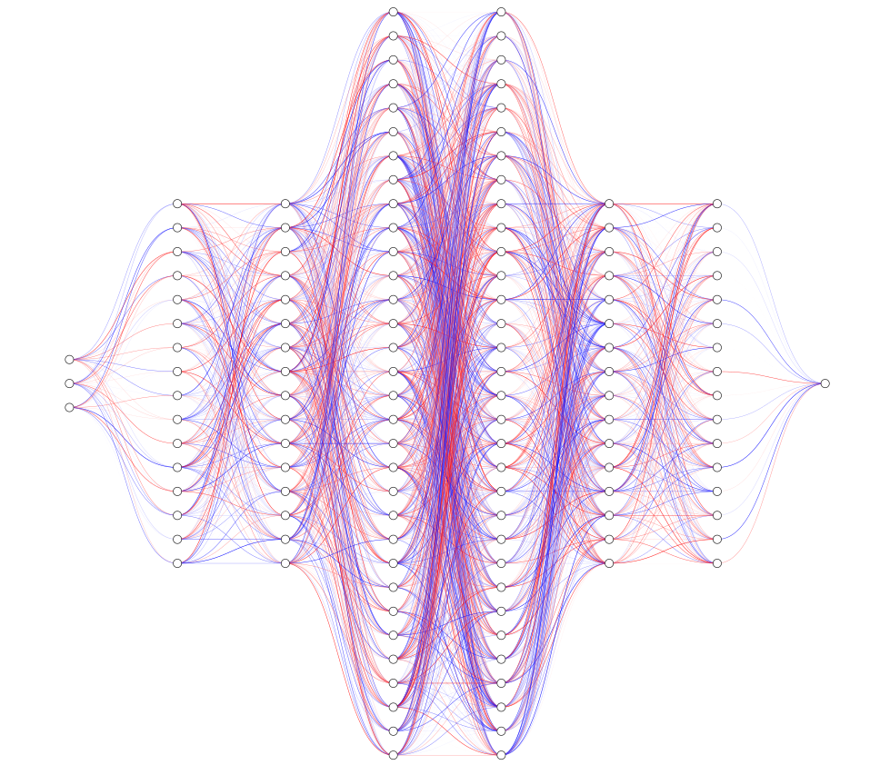

<h1 align="center">✨ Binary Image Classification Neural Network ✨</h1>

<h6 align="center"><em>Deep learning model for binary image classification using CNN architecture</em></h6>

## 📝 Overview

This project implements a Convolutional Neural Network (CNN) for binary image classification. The model features automated data preprocessing, GPU optimization, and comprehensive evaluation metrics.

## 🔢 Mathematical Foundation

### Data Preprocessing
Image scaling is performed using:
```math
X_{scaled} = \frac{X}{255}
```
**Where:**
`X` is the input image pixel matrix values
```math
X \in \mathbb{R}^{H \times W \times 4}
```
- `H` is the height (number of rows)
- `W` is the width (number of columns)
- `4` is the constant number of channels **(RGBA)**

Each pixel at position `(i, j)` is a vector:
```math
X_{i,j} = \begin{bmatrix} R & G & B & A \end{bmatrix}
```

### Model Metrics
The model uses three key metrics:
1. Binary Accuracy:
```math
Accuracy = \frac{TP + TN}{TP + TN + FP + FN}
```
2. Precision:
```math
Precision = \frac{TP}{TP + FP}
```
3. Recall:
```math
Recall = \frac{TP}{TP + FN}
```

**Where:**
```math
\begin{aligned}
TP &= |\{x \in \mathbb{D} \mid x \text{ is positive and classified as positive}\}| \\
TN &= |\{x \in \mathbb{D} \mid x \text{ is negative and classified as negative}\}| \\
FP &= |\{x \in \mathbb{D} \mid x \text{ is negative but classified as positive}\}| \\
FN &= |\{x \in \mathbb{D} \mid x \text{ is positive but classified as negative}\}|
\end{aligned}
```

## 🛠 Architecture

### Hidden Layers

| Layer (type)        | Output Shape       | Param #  |
|---------------------|-------------------|---------:|
| **conv2d (Conv2D)** | (None, 254, 254, 16) | 448     |
| **max_pooling2d (MaxPooling2D)** | (None, 127, 127, 16) | 0 |
| **conv2d_1 (Conv2D)** | (None, 125, 125, 32) | 4,640 |
| **max_pooling2d_1 (MaxPooling2D)** | (None, 62, 62, 32) | 0 |
| **conv2d_2 (Conv2D)** | (None, 60, 60, 16) | 4,624 |
| **max_pooling2d_2 (MaxPooling2D)** | (None, 30, 30, 16) | 0 |
| **flatten (Flatten)** | (None, 14400) | 0 |
| **dense (Dense)** | (None, 256) | 3,686,656 |
| **dense_1 (Dense)** | (None, 1) | 257 |

### Neural Network Visualization
###### _It kinda looks like a cool jellyfish!_



### Summary
- Model Type: **Sequential**
- Total Model Size: **14.1MB**
- Total Parameters: **3,396,627**
- Trainable Parameters: **3,396,625**
- Non-Trainable Parameters: **0**
- Optimized Parameters: **2**

## 🔧 Features
- GPU memory optimization
- Automated image format validation
- Data scaling and preprocessing
- Train-test-validation split (70-20-10)
- TensorBoard logging support
- Model persistence (Save & Load)

## 💻 Usage
```python
# Initialize GPU optimization
prep_gpus()

# Create data pipeline
data = Data('category_a', 'category_b')

# Create and train OR load model
model = Model(data)

# Evaluate on test data
precision, recall, accuracy = model.evaluate_model(test_data)

# Run prediction on feature matrix `X`
result = model._predict(X)
```

## 📊 Input Requirements
- Images must be in supported formats: **JPEG, JPG, BMP, PNG**
- Input shape: `(256, 256, 3)`
- Images are automatically scaled to `[0,1]`

### Directory structure:
```
data/
├── category_a/
│   ├── image1.png
│   └── image2.png
└── category_b/
    ├── image3.png
    └── image4.png
```

Feel free to rename the child directories to whatever you want.
They are expected as arguments in the model later anyways.

## ⚙️ Model Parameters
- Optimizer: Adam
- Loss: Binary Cross Entropy
- Training epochs: 30
- Batch size: Default TensorFlow
- Train-Test-Val split: 70-20-10

## 💾 Model Persistence
Models are automatically saved to:
```
trained/model.h5
```

## 📊 Logging
TensorBoard logs are stored in:
```
logs/
```

## 📃 License
This project uses the `GNU GENERAL PUBLIC LICENSE v3.0` license
<br>
For more info, please find the `LICENSE` file here: [License](LICENSE)