<h1 align="center">✨ Binary Image Classification Neural Network ✨</h1>

<h6 align="center"><em>Deep learning model for binary image classification using CNN architecture</em></h6>

## 📝 Overview

This project implements a Convolutional Neural Network (CNN) for binary image classification. The model features automated data preprocessing, GPU optimization, and comprehensive evaluation metrics.

## 🌐 External Libraries
- [Tensorflow/Keras](https://www.tensorflow.org/)
- [PyTorch](https://pytorch.org/)

## 🔢 Mathematical Foundation

### Data Preprocessing
Image scaling is performed using:

```math
X_{scaled} = \frac{X}{255}
```

**Where**

- $X$ is the input image pixel matrix values

**And**

```math
X \in \mathbb{R}^{H \times W \times 3}
```

- $H$ is the height (number of rows)
- $W$ is the width (number of columns)
- $3$ is the constant number of channels **(RGB)**

Each pixel at position $(i, j)$ is a vector:

```math
X_{i,j} = \begin{bmatrix} R & G & B \end{bmatrix}
```

Here's a representation of what this looks like:
```python
[[[  0  61  82]
  [  2  63  81]
  [  1  64  79]
  ...
  [  0   0   0]
  [  0   0   0]
  [  0   1   0]]

 [[  2  64  83]
  [  2  64  81]
  [  1  64  78]
  ...
  [  0   0   0]
  [  0   1   0]
  [  1   1   1]]

 ...

 [[  0   1   0]
  [  0   0   0]
  [  0   0   0]
  ...
  [ 34  22  62]
  [ 35  24  63]
  [ 37  24  64]]]
```

###### _Note that an `RGBA` vector would just discard the 4th channel._

### Model Metrics
The model uses three key metrics:
1. Binary Accuracy:

```math
\frac{TP + TN}{TP + TN + FP + FN}
```

2. Precision:

```math
\frac{TP}{TP + FP}
```

3. Recall:

```math
\frac{TP}{TP + FN}
```

**Where:**

```math
\begin{aligned}
TP &= |\{x \in \mathbb{D} \mid x \text{ is positive and classified as positive}\}| \\
TN &= |\{x \in \mathbb{D} \mid x \text{ is negative and classified as negative}\}| \\
FP &= |\{x \in \mathbb{D} \mid x \text{ is negative but classified as positive}\}| \\
FN &= |\{x \in \mathbb{D} \mid x \text{ is positive but classified as negative}\}|
\end{aligned}
```

### Activation Functions

**1. ReLU**

The model applies the **Rectified Linear Unit (ReLU)** activation function
to all hidden layers, except for the last dense layer.
<br><br>
The **ReLU** function is defined as:

```math
ReLU(x) = x^+ = \frac{x + |x|}{2} =
\begin{cases} 
0 & \text{if } x \leq 0 \\ 
x & \text{if } x > 0
\end{cases}
```

**Properties:**
- Domain: $x \in \mathbb{R}$
- Range: $[0, \infty)$

The function essentially outputs $0$ for negative inputs and $x$ for positive inputs.
This helps prevent the vanishing gradient problem, making deep learning models train faster.
However, it's important to note that the function could suffer from the "dying ReLU" problem,
where neurons can become inactive.

**Plotting this function out:**


<br>

**2. Sigmoid**

On the final output dense layer, a single neuron, applies a sigmoid activation function.
The benefits of this methodology are described later on.
<br>
Generally speaking, its because it provides a clear binary output.
<br><br>
The **Sigmoid** function is defined as:

```math
\sigma(x) = \frac{L}{1 + e^{-k(x-x_0)}}
```

**Where:**

```math
L = 1, k = 1, x_0 = 0
```

**Applying these to the equation:**

```math
\sigma(x) = \frac{1}{1 + e^{-x}}
```

**Plotting this function out:**


<br>

By visualizing the function, we can see that it's perfect to solve a binary problem
<br>
since it represents an output range of $(0,1)$ which is perfect for probabilities.
<br>
This prospect makes the function perfect to provide a clear binary output.

### Adam Optimizer
The model makes use of the Adam Optimizer, which is a powerful optimization algorithm that combines the benefits of SGD
<br>
(Stochastic Gradient Descent) with momentum and adaptive learning rates. It adjusts learning rates dynamically for each parameter.
<br>
The algorithm updates the weights using the following equations:

```math
\mathbf{m}t = \beta_1\mathbf{m}{t-1} + (1-\beta_1)\nabla_{\theta}J(\theta_{t-1})
```

```math
\mathbf{v}t = \beta_2\mathbf{v}{t-1} + (1-\beta_2)(\nabla_{\theta}J(\theta_{t-1}))^2
```

```math
\hat{\mathbf{m}}_t = \frac{\mathbf{m}_t}{1-\beta_1^t}
```

```math
\hat{\mathbf{v}}_t = \frac{\mathbf{v}_t}{1-\beta_2^t}
```

```math
\theta_t = \theta_{t-1} - \alpha\frac{\hat{\mathbf{m}}_t}{\sqrt{\hat{\mathbf{v}}_t} + \epsilon}
```

**Where:**
- $\mathbf{m}_t$: First moment estimate
- $\mathbf{v}_t$: Second moment estimate
- $\beta_1, \beta_2$: Exponential decay rates (typically $\beta_1=0.9$, $\beta_2=0.999$)
- $\alpha$: Learning rate
- $\epsilon$: Small constant for numerical stability ($\approx 10^{-8}$)
- $\theta$: Model parameters
- $J(\theta)$: Objective function

**Logic Flow:**


### Binary Cross-Entropy Loss

The model makes use of the **BCE** loss function, which is the standard loss function used in binary classification problems.
<br>
It measures how well the model's predicted probability distribution matches the actual labels.

**It is defined as:**

```math
L = -\frac{1}{N}\sum_{i=1}^{N}[y_ilog(\hat{y}_i)+(1-y_i)log(1-\hat{y}_i)]
```

For binary classification with predicted probability $\hat{y}$ and true label $y$:

```math
\mathcal{L}(y, \hat{y}) = -[y\log(\hat{y}) + (1-y)\log(1-\hat{y})]
```

**Properties:**
- Domain: $y \in \{0,1\}, \hat{y} \in (0,1)$
- Range: $[0, \infty)$

**Derivative with respect to logits:**

```math
\frac{\partial \mathcal{L}}{\partial \hat{y}} = \frac{\hat{y} - y}{\hat{y}(1-\hat{y})}
```

**Logic Flow:**



```mermaid
flowchart LR
    M[True Label y] --> O[Compute Loss]
    N[Predicted ŷ] --> O
    O --> P[Backpropagate]
```

**This function works well due to:**
- Probability-Based Loss $\rightarrow$ Since *BCE* is based on log probabilitiy, it ensures that predictions are as close to $0$ or $1$ as possible.
- Penalization of Incorrect Confident Predictions $\rightarrow$ Large penalties for being confidently wrong (i.e., predicting $0.99$ when the true label is $0$).
- Handling Imbalanced Datasets Well $\rightarrow$ If class distribution is skewed *BCE* still provides meaningful gradients.

### Convolutional Blocks

_**Conv2D:**_

The *Conv2D* layer applies a 2D convolution operation to the input. This is a sliding window (kernel/filter)
operation that extracts local patterns or features from the input (such as edges, textures, etc. in images).

We define the *Conv2D* layer as:

```math
f_1(\mathbf{X}) = \text{ReLU}(\mathbf{W}_1 * \mathbf{X} + \mathbf{b}_1)
```

**Where:**
- $X$ is the input tensor
- $W_1$ is the kernel matrix
- $b_1$ is the bias term

We define the kernel as:

```math
\mathbf{W}_1 \in \mathbb{R}^{3 \times 3 \times 3 \times 16}
```
<br>

The following is the convolution function applying *ReLU* activation function:

```math
f_1(X) = ReLU(\sum_{m=0}^{3-1}\sum_{n=0}^{3-1}\sum_{c=0}^{3-1}x_{i+m,j+n,c}\cdot w_{m,n,c,j}+b_k)
```

**Where:**
- $x_{i+m,j+n,c}$ is the input
- $w_{m,n,c,j}$ are the kernel weights
- $b_k$ is the bias for each output channel $k$

_**MaxPooling2D:**_

The *MaxPooling2D* layer reduces the spatial dimensions of the input by taking the maximum value from a defined region (typically a window of size $2\times 2$ or $3\times 3$).

It can be defined as follows:
```math
\text{pool}_1(f_1)(m,n) = \begin{cases}\max\limits_{(i,j)\in W}f_1(i,j) & \text{if }(i,j)\in W_{m,n}\\
0 & \text{otherwise}
\end{cases}
```

**Where:**
- $f_1(i,j)$ refers to the result of the convolution from the previous layer (i.e., the $f_1(X)$ output).
- $W_{m,n}$ refers to the pooling window centered at the position $(m,n)$.
- The operation takes the maximum values of the window $W$ over each channel.

*Simplifying:*

```math
\text{pool}_1(f_1)(m,n) = \max\limits_{(i,j)\in W}f_1(i,j)
```

Which means that for each position $(m,n)$ in the output feature map, the maximum value can be taken from the corresponding region $W$ in $f_1(X)$.

The function can be more formally expressed as:

```math
\text{pool}_1(f_1)(m,n) = \max\limits_{(i,j)\in W_{m,n}}f_1(i,j)
```

Consider the same for the other two convolution blocks,
<br>
except the amount of neurons and parameters change.

### Dense Layers

_**Flatten:**_

A Flatten layer is used to convert a multi-dimensional tensor into a one-dimensional vector, while retaining the batch size.
<br>
The mathematical operation for flattening is relatively simple:
<br>
It takes an input tensor of shape:

```math
\begin{bmatrix}
N & d_1,d_2,...,d_n
\end{bmatrix}
```

Where $N$ is the batch size.
The layer reshapes it into a one-dimensional vector of shape:

```math
\begin{bmatrix}
N & d_1\cdotp d_2\cdotp\cdotp\cdotp\cdotp d_n
\end{bmatrix}
```

The flattening combines the dimensions $d_1,d_2,...,d_n$ into a single dimension, resulting in a vector of length:

```math
d_1\times d_2 \times ... \times d_n
```

If $X$ is the input tensor and $X_{i,j,k}$ represents the elements of this tensor, the output vector $y$ after flattening can be represented as:

```math
y_i = X_{i,d_1,d_2,...,d_n}
```

**Where:**

- $i$ is the index of the flattened vector, starting from 0.
- The values $X_{i,d_1,d_2,...,d_n}$ are taken in a row-major order (i.e., elements are flattened by traversing all dimensions in sequence).

Therefore, given a batch size of $16384$, we can define the function as follows:

```math
\text{flat}(\text{pool}_3) \in \mathbb{R}^{16384}
```

_**Dense Layer:**_

The *Dense* (fully connected) layer connects each neuron from the previous layer to every neuron in the current layer.

The dense layer computes the output $y$ as follows:

```math
y = XW+b
```

**Where:**
- $X$ is the input tensor
- $W$ is the weights matrix
- $b$ is the bias vector

Including a non-linear activation function $f$, then the final output is:

```math
y = f(XW+b)
```

Given our known input tensor:

```math
X_4 \in \mathbb{R}^{16384 \times 256}
```

And applying our known constants:

```math
h_1(\text{flat}) = \text{ReLU}(X_4\text{flat} + \mathbf{b}_4)
```

_**Output Layer:**_

The final output layer is also a *Dense* layer, however to get our desired binary output,
<br>
we apply the sigmoid activation function (rather than ReLU):

```math
y(\mathbf{h}_1) = \sigma(\mathbf{W}_5\mathbf{h}_1 + \mathbf{b}_5)
```

**Where:**

- The sigmoid function is defined as:

```math
\sigma(x) = \frac{1}{1 + e^{-x}}
```

- $\mathbf{W}_5$ is defined as:

```math
\mathbf{W}_5 \in \mathbb{R}^{256 \times 1}
```

## ✅ Practical Application

To demonstrate a proof of concept, the model was trained on pneumonia xrays.
<br>
This model can be used in medical applications, however the architecture
<br>
can be trained on any data, and can provide applications in all fields
<br>
You can find the dataset here: [Dataset](https://www.kaggle.com/datasets/paultimothymooney/chest-xray-pneumonia)

### Results
- Accuracy: 99.91%
- Loss: 0.3%
- Epochs: 30

To see the training logs and results, view the TensorBoard logfile:
[TensorBoardLog](logs/pneumonia.events.out.tfevents.1740090494.LUCA.15816.0.v2)

**To view the log:**

```sh
tensorboard --logdir=./logs/
```

### Learning Curves


### Visualizing

###### _(Model's Predictions Visualization)_


### Trained Model
The trained and compiled model can be found at:
```
trained/Pneumonia_Model.h5
```

## 🛠 Architecture

### Input Layer

Applying what was previously discussed,
<br>
the model expects an image of shape:

```math
\begin{bmatrix} 256, 256, 3 \end{bmatrix}
```

**Plugging in these constants:**

```math
\mathbf{X} \in \mathbb{R}^{256 \times 256 \times 3}
```

### Hidden Layers

| Layer (type)        | Output Shape       | Param #  |
|---------------------|-------------------|---------:|
| **conv2d (Conv2D)** | (None, 254, 254, 16) | 448     |
| **max_pooling2d (MaxPooling2D)** | (None, 127, 127, 16) | 0 |
| **conv2d_1 (Conv2D)** | (None, 125, 125, 32) | 4,640 |
| **max_pooling2d_1 (MaxPooling2D)** | (None, 62, 62, 32) | 0 |
| **conv2d_2 (Conv2D)** | (None, 60, 60, 16) | 4,624 |
| **max_pooling2d_2 (MaxPooling2D)** | (None, 30, 30, 16) | 0 |
| **flatten (Flatten)** | (None, 14400) | 0 |
| **dense (Dense)** | (None, 256) | 3,686,656 |
| **dense_1 (Dense)** | (None, 1) | 257 |

### Neural Network Visualization
###### _It kinda looks like a cool jellyfish!_


### AlexNet Style Visualization


### LeNet Style Visualization
###### _Note that the 14400 sized vector is missing here because it's just too large_


### Summary
- Model Type: **Sequential**
- Total Model Size: **14.1MB**
- Total Parameters: **3,396,627**
- Trainable Parameters: **3,396,625**
- Non-Trainable Parameters: **0**
- Optimized Parameters: **2**

## 🔧 Features
- GPU memory optimization
- Automated image format validation
- Data scaling and preprocessing
- Train-test-validation split (70-20-10)
- TensorBoard logging support
- Model persistence (Save & Load)

## 💻 Usage
```python
from Model import Model, Data
import tensorflow as tf

# Create data pipeline
data = Data('category_a', 'category_b')

# Create and train OR load model
model = Model(data)

# Evaluate on test data
precision, recall, accuracy = model.evaluate_model(test_data)

# Read and process image
img = tf.io.read_file(image_path)
img = tf.image.decode_image(img, channels=3)
resize = tf.image.resize(img, (256, 256))

# Predict image class
pred = model.predict(np.expand_dims(resize/255, 0))[0][0]

# Determine image category
is_category_a: bool = pred < 0.5
```

## 📊 Input Requirements
- Images must be in supported formats: **JPEG, JPG, BMP, PNG**
- Input shape: `(256, 256, 3)`
- Images are automatically scaled to `[0,1]`

### Directory structure:
```
data/
├── category_a/
│   ├── image1.png
│   └── image2.png
└── category_b/
    ├── image3.png
    └── image4.png
```

Feel free to rename the child directories to whatever you'd like.
Later, They are expected as arguments in the model.

## ⚙️ Model Parameters
- Optimizer: Adam
- Loss: Binary Cross Entropy
- Training epochs: 30
- Batch size: Default TensorFlow
- Train-Test-Val split: 70%-20%-10%

## 💾 Model Persistence
Models are automatically saved to:
```
trained/model.h5
```

## 📊 Logging
TensorBoard logs are stored in:
```
logs/
```

## ✨ Future Improvements
- Port to C++ using [TorchLib](https://pytorch.org/cppdocs/)
- C++ code rewrite to further improve existing code

## 📃 License
This project uses the `GNU GENERAL PUBLIC LICENSE v3.0` license
<br>
For more info, please find the `LICENSE` file here: [License](LICENSE)