```mermaid
flowchart LR
    M[True Label y] --> O[Compute Loss]
    N[Predicted ŷ] --> O
    O --> P[Backpropagate]
```

<h1 align="center">✨ Binary Image Classification Neural Network ✨</h1>

<h6 align="center"><em>Deep learning model for binary image classification using CNN architecture</em></h6>

## 📝 Overview

This project implements a Convolutional Neural Network (CNN) for binary image classification. The model features automated data preprocessing, GPU optimization, and comprehensive evaluation metrics.

Please keep in mind that this project was made a long, **long**, time ago. I did my best to explain it here.
<br>
It's also quite small and not nearly as sophisticated as I would probably make it today.

## 🔢 Mathematical Foundation

### Data Preprocessing
Image scaling is performed using:

```math
X_{scaled} = \frac{X}{255}
```

**Where**

- $X$ is the input image pixel matrix values

**And**

```math
X \in \mathbb{R}^{H \times W \times 3}
```

- $H$ is the height (number of rows)
- $W$ is the width (number of columns)
- $3$ is the constant number of channels **(RGB)**

Each pixel at position $(i, j)$ is a vector:

```math
X_{i,j} = \begin{bmatrix} R & G & B \end{bmatrix}
```

Here's a representation of what this looks like:
```python
[[[  0  61  82]
  [  2  63  81]
  [  1  64  79]
  ...
  [  0   0   0]
  [  0   0   0]
  [  0   1   0]]

 [[  2  64  83]
  [  2  64  81]
  [  1  64  78]
  ...
  [  0   0   0]
  [  0   1   0]
  [  1   1   1]]

 ...

 [[  0   1   0]
  [  0   0   0]
  [  0   0   0]
  ...
  [ 34  22  62]
  [ 35  24  63]
  [ 37  24  64]]]
```

###### _Note that an `RGBA` vector would just discard the 4th channel._

### Model Metrics
The model uses three key metrics:
1. Binary Accuracy:

```math
\frac{TP + TN}{TP + TN + FP + FN}
```

2. Precision:

```math
\frac{TP}{TP + FP}
```

3. Recall:

```math
\frac{TP}{TP + FN}
```

**Where:**

```math
\begin{aligned}
TP &= |\{x \in \mathbb{D} \mid x \text{ is positive and classified as positive}\}| \\
TN &= |\{x \in \mathbb{D} \mid x \text{ is negative and classified as negative}\}| \\
FP &= |\{x \in \mathbb{D} \mid x \text{ is negative but classified as positive}\}| \\
FN &= |\{x \in \mathbb{D} \mid x \text{ is positive but classified as negative}\}|
\end{aligned}
```

### Activation Functions

**1. ReLU**

The model applies the **Rectified Linear Unit (ReLU)** activation function
to virtually all hidden layers, except for the last dense layer.
<br><br>
The **ReLU** function is defined as:

```math
ReLU(x) = x^+ = \frac{x + |x|}{2} =
\begin{cases} 
0 & \text{if } x \leq 0 \\ 
x & \text{if } x > 0
\end{cases}
```

**Properties:**
- Domain: $x \in \mathbb{R}$
- Range: $[0, \infty)$

The function essentially outputs $0$ for negative inputs and $x$ for positive inputs.
This helps prevent the vanishing gradient problem, making deep learning models train faster.
However, it's important to note that it could suffer from the "dying ReLU" problem,
where neurons can become inactive.

**Plotting this function out:**


<br>

**2. Sigmoid**

On the final output dense layer, a single neuron, applies a sigmoid activation function.
The benefits of this are described later on.
<br>
Generally speaking, its because it provides a clear binary output.
<br><br>
The **Sigmoid** function is defined as:

```math
f(x) = \frac{L}{1 + e^{-k(x-x_0)}}
```

**Where:**

```math
L = 1, k = 1, x_0 = 0
```

**Applying these to the equation:**

```math
f(x) = \frac{1}{1 + e^{-x}}
```

**Plotting this function out:**


<br>

Visualizing the function, we can see that it's perfect for a binary problem
<br>
since it has an output range of $(0,1)$ which is perfect for representing probabilities.
<br>
This makes the function perfect to provide a clear binary output.

### Adam Optimizer
The model makes use of the adam optimizer, Adam is a powerful optimization algorithm that combines the benefits of SGD
<br>
(Stochastic Gradient Descent) with momentum and adaptive learning rates. It adjusts learning rates dynamically for each parameter.
<br>
The algorithm updates the weights using the following equations:

```math
\mathbf{m}t = \beta_1\mathbf{m}{t-1} + (1-\beta_1)\nabla_{\theta}J(\theta_{t-1})
```

```math
\mathbf{v}t = \beta_2\mathbf{v}{t-1} + (1-\beta_2)(\nabla_{\theta}J(\theta_{t-1}))^2
```

```math
\hat{\mathbf{m}}_t = \frac{\mathbf{m}_t}{1-\beta_1^t}
```

```math
\hat{\mathbf{v}}_t = \frac{\mathbf{v}_t}{1-\beta_2^t}
```

```math
\theta_t = \theta_{t-1} - \alpha\frac{\hat{\mathbf{m}}_t}{\sqrt{\hat{\mathbf{v}}_t} + \epsilon}
```

**Where:**
- $\mathbf{m}_t$: First moment estimate
- $\mathbf{v}_t$: Second moment estimate
- $\beta_1, \beta_2$: Exponential decay rates (typically $\beta_1=0.9$, $\beta_2=0.999$)
- $\alpha$: Learning rate
- $\epsilon$: Small constant for numerical stability ($\approx 10^{-8}$)
- $\theta$: Model parameters
- $J(\theta)$: Objective function

**Logic Flow:**


### Binary Cross-Entropy Loss

The model makes use of the **BCE** loss function, its the standard loss function used in binary classification problems.
<br>
It measures how well the model's predicted probability distribution matches the actual labels.

**Its defined as:**

```math
L = -\frac{1}{N}\sum_{i=1}^{N}[y_ilog(\hat{y}_i)+(1-y_i)log(1-\hat{y}_i)]
```

For binary classification with predicted probability $\hat{y}$ and true label $y$:

```math
\mathcal{L}(y, \hat{y}) = -[y\log(\hat{y}) + (1-y)\log(1-\hat{y})]
```

**Properties:**
- Domain: $y \in \{0,1\}, \hat{y} \in (0,1)$
- Range: $[0, \infty)$

**Derivative with respect to logits:**

```math
\frac{\partial \mathcal{L}}{\partial \hat{y}} = \frac{\hat{y} - y}{\hat{y}(1-\hat{y})}
```

**Logic Flow:**



**This works well because:**
- Porbability-Based Loss $\rightarrow$ Since *BCE* is based on log probabilitiy, it ensures that predictions are as close to $0$ or $1$ as possible.
- Penalizes Incorrect Confident Predictions $\rightarrow$ Large penalties for being confidently wrong (i.e., predicting $0.99$ when the true label is $0$).
- Handles Imbalanced Datasets Well $\rightarrow$ If class distribution is skewed *BCE* still provides meaningful gradients.

### Convolutional Blocks

*Conv2D:*

```math
f_1(\mathbf{X}) = \text{ReLU}(\mathbf{W}_1 * \mathbf{X} + \mathbf{b}_1)
```

*Kernel:*

```math
\mathbf{W}_1 \in \mathbb{R}^{3 \times 3 \times 3 \times 16}
```

*MaxPooling2D:*

```math
\text{pool}_1(f_1)(m,n) = \begin{cases}\max\limits_{(i,j)\in W}f_1(i,j) & \text{if }(i,j)\in W_{m,n}\\
0 & \text{otherwise}
\end{cases}
```

*Simplifying:*

```math
\text{pool}_1(f_1)(m,n) = \max\limits_{(i,j)\in W}f_1(i,j)
```

Consider the same for the other two convolution blocks,
<br>
except the amount of neurons and parameters change.

### Dense Layers

*Flatten:*

```math
\text{flat}(\text{pool}_3) \in \mathbb{R}^{16384}
```

*Dense Layer:*

```math
h_1(\text{flat}) = \text{ReLU}(\mathbf{W}_4\text{flat} + \mathbf{b}_4)\\
\mathbf{W}_4 \in \mathbb{R}^{16384 \times 256}
```

*Output Layer:*

```math
y(\mathbf{h}_1) = \sigma(\mathbf{W}_5\mathbf{h}_1 + \mathbf{b}_5)\\
\mathbf{W}_5 \in \mathbb{R}^{256 \times 1}\\
\sigma(x) = \frac{1}{1 + e^{-x}}
```

## ✅ Practical Application

To demonstrate proof of concept, I went ahead and trained the model on pneumonia xrays.
<br>
I feel I don't need to state the obvious on how this could be useful.
<br>
You can find the dataset here: [Dataset](https://www.kaggle.com/datasets/paultimothymooney/chest-xray-pneumonia)

### Results
Here's the results:
- Accuracy: 99.91%
- Loss: 0.3%
- Epochs: 30

### Visualizing


###### _The model was indeed highly accurate at determining if the xray patient has pneumonia or not_

### Trained Model
I left the trained and compiled model at:
```
trained/Pneumonia_Model.h5
```

## 🛠 Architecture

### Input Layer

Applying what was previously discussed, the model expects an
<br>
image of shape $\begin{bmatrix} 256, 256, 3 \end{bmatrix}$, plugging in these constants:

$\mathbf{X} \in \mathbb{R}^{256 \times 256 \times 3}$

### Hidden Layers

| Layer (type)        | Output Shape       | Param #  |
|---------------------|-------------------|---------:|
| **conv2d (Conv2D)** | (None, 254, 254, 16) | 448     |
| **max_pooling2d (MaxPooling2D)** | (None, 127, 127, 16) | 0 |
| **conv2d_1 (Conv2D)** | (None, 125, 125, 32) | 4,640 |
| **max_pooling2d_1 (MaxPooling2D)** | (None, 62, 62, 32) | 0 |
| **conv2d_2 (Conv2D)** | (None, 60, 60, 16) | 4,624 |
| **max_pooling2d_2 (MaxPooling2D)** | (None, 30, 30, 16) | 0 |
| **flatten (Flatten)** | (None, 14400) | 0 |
| **dense (Dense)** | (None, 256) | 3,686,656 |
| **dense_1 (Dense)** | (None, 1) | 257 |

### Neural Network Visualization
###### _It kinda looks like a cool jellyfish!_


### AlexNet Style Visualization


### LeNet Style Visualization
###### _Note that the 14400 sized vector is missing here because its just too large_


#### _Sorry for the low resolution! It's hard to fit these massive visualizations in a readme document!_

### Summary
- Model Type: **Sequential**
- Total Model Size: **14.1MB**
- Total Parameters: **3,396,627**
- Trainable Parameters: **3,396,625**
- Non-Trainable Parameters: **0**
- Optimized Parameters: **2**

## 🔧 Features
- GPU memory optimization
- Automated image format validation
- Data scaling and preprocessing
- Train-test-validation split (70-20-10)
- TensorBoard logging support
- Model persistence (Save & Load)

## 💻 Usage
```python
from Model import Model, Data
import tensorflow as tf

# Create data pipeline
data = Data('category_a', 'category_b')

# Create and train OR load model
model = Model(data)

# Evaluate on test data
precision, recall, accuracy = model.evaluate_model(test_data)

# Read and process image
img = tf.io.read_file(image_path)
img = tf.image.decode_image(img, channels=3)
resize = tf.image.resize(img, (256, 256))

# Predict image class
pred = model.predict(np.expand_dims(resize/255, 0))[0][0]

# Determine image category
is_category_a: bool = pred < 0.5
```

## 📊 Input Requirements
- Images must be in supported formats: **JPEG, JPG, BMP, PNG**
- Input shape: `(256, 256, 3)`
- Images are automatically scaled to `[0,1]`

### Directory structure:
```
data/
├── category_a/
│   ├── image1.png
│   └── image2.png
└── category_b/
    ├── image3.png
    └── image4.png
```

Feel free to rename the child directories to whatever you want.
They are expected as arguments in the model later anyways.

## ⚙️ Model Parameters
- Optimizer: Adam
- Loss: Binary Cross Entropy
- Training epochs: 30
- Batch size: Default TensorFlow
- Train-Test-Val split: 70-20-10

## 💾 Model Persistence
Models are automatically saved to:
```
trained/model.h5
```

## 📊 Logging
TensorBoard logs are stored in:
```
logs/
```

## 📃 License
This project uses the `GNU GENERAL PUBLIC LICENSE v3.0` license
<br>
For more info, please find the `LICENSE` file here: [License](LICENSE)